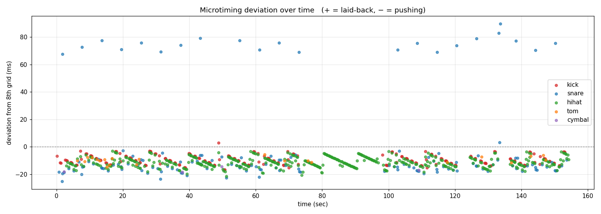
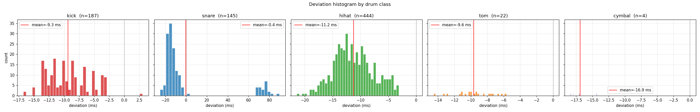
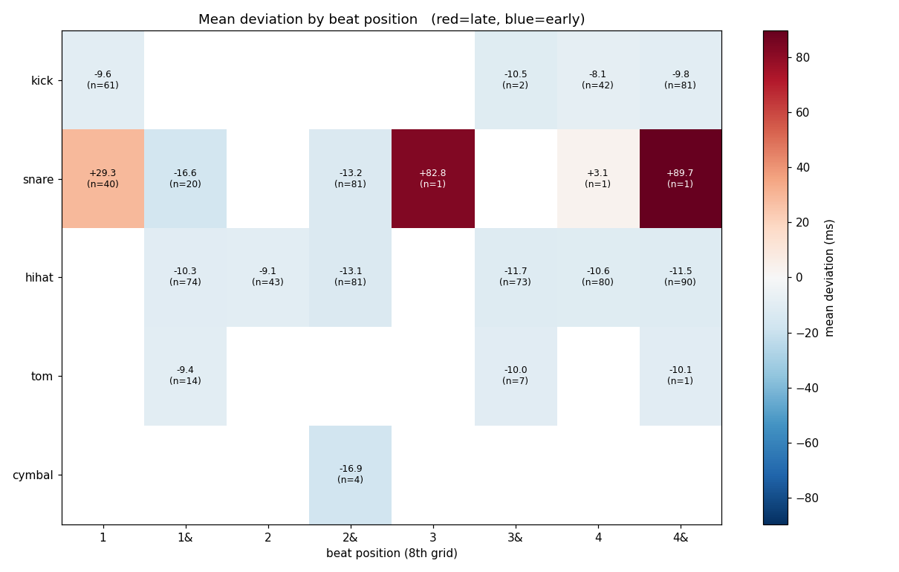
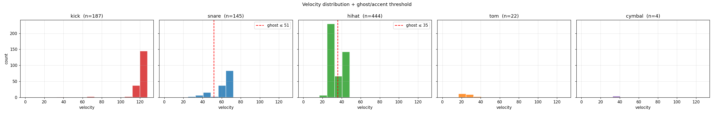
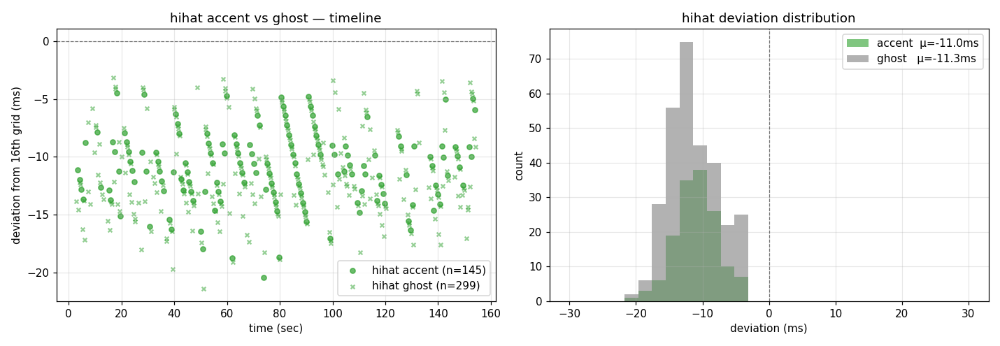

# Drum2midi

**Microtiming analysis of drums from polyphonic audio.**
Measures how each drum hit deviates from the beat grid in milliseconds —
without quantizing — to expose the human feel (swing, push/pull, ghost
notes) baked into a recording.

Input: a stereo WAV of electronic music (dub, EDM, etc.) with mixed
melodic instruments and minimal vocals.

Output: a MIDI file that preserves the original absolute timing of every
drum hit, plus statistics, visualizations, and a CSV with per-hit
deviation values.

---

## Why

Drum machines and quantized programming snap every hit to a rigid grid.
Human drummers don't — they push, lag, swing, and accent within a few
milliseconds of the grid, and that micro-rhythmic vocabulary is the
difference between a sterile beat and a groove that moves the body.

Most drum-transcription tools quantize their output. This pipeline
deliberately does not. The goal is to *measure* the deviations precisely
so that a producer can:

- Quantify the groove DNA of a reference recording.
- Compare microtiming signatures across different songs, drummers, or
  genres.
- Audit programmed drums for whether they sound "too perfect."
- Build humanization tools that inject learned microtiming back into
  quantized MIDI.

---

## Example output

A 161.68 BPM rock track (~180 s), drums separated and analyzed.
Summary printed to console and `summary.txt`:

```
class    count    mean dev (ms)    std (ms)   notes
────────────────────────────────────────────────────────────
kick       187           −9.33        3.48    consistent push
snare      145           −0.40       32.25    backbeat, 16th-flexible
hihat      444          −11.22        3.56    tightest, "groove spine"
tom         22           −9.64        2.28
cymbal       4          −16.88        1.84
────────────────────────────────────────────────────────────
swing_ratio = 1.000 (straight 8ths)
ghost notes: hihat 299/444 (67%), snare 24/145 (17%)
```

### Visualizations

Each run produces five plots. Below are the actual outputs from the
analysis above.

**Microtiming over time.** Each dot is one drum hit; y-axis is the
deviation from the nearest 8th-note grid point in ms (positive = late,
negative = early). The consistent negative bias across all classes
shows this drummer pushes every hit ~10 ms ahead of the grid.



**Deviation histograms per class.** Tight distributions (low std) mean
the drummer is metronomically consistent within that class. The hi-hat
peak being far from zero with a narrow spread is a signature of a
locked-in groove drummer.



**Mean deviation by beat position.** Reveals whether the drummer
behaves differently at the 1st beat vs the 3rd, or on downbeats vs
offbeats. Color encodes mean ms (red = late, blue = early).



**Velocity distribution with ghost/accent threshold.** A bimodal
velocity distribution (two clear peaks) means the class has separable
accent / ghost groups; the red dashed line marks the auto-detected
threshold. Single-peak distributions (e.g., kick here) get no ghost
labels.



**Ghost vs accent comparison.** The most musically interesting plot:
how do ghost notes deviate from accents in microtiming? In dub and
funk, ghost notes often sit further laid-back; in tight rock playing,
they ride the same pocket. Left panel shows time-localized scatter,
right panel shows distribution overlap.



---

## Pipeline

```
┌─────────────────────────────────────────────────────────────────────┐
│  INPUT: stereo WAV (mixed instruments)                              │
└─────────────────────────────────────────────────────────────────────┘
                                │
                                ▼
  ┌──────────────────────────────────────────────────────────────┐
  │ Stage 1: SOURCE SEPARATION                                   │
  │   Demucs v4 (htdemucs_ft) extracts the drum stem             │
  │   → outputs/<song>/drums.wav                                 │
  └──────────────────────────────────────────────────────────────┘
                                │
                                ▼
  ┌──────────────────────────────────────────────────────────────┐
  │ Stage 2: DRUM TRANSCRIPTION (5-class)                        │
  │   ADTOF-pytorch (Frame_RNN) → kick / snare / tom / hihat /   │
  │                               cymbal onsets                  │
  │   Fallback chain: ADTOF → OaF → librosa band-onset           │
  │   → raw_onsets.json                                          │
  └──────────────────────────────────────────────────────────────┘
                                │
                                ▼
  ┌──────────────────────────────────────────────────────────────┐
  │ Stage 3: SAMPLE-PRECISION ONSET REFINEMENT                   │
  │   Stage 2 onsets are frame-quantized (≈10 ms). For each      │
  │   coarse onset, apply class-specific band filter, then take  │
  │   the peak of d|x|²/dt within a ±50 ms window for sample-    │
  │   accurate timing.                                           │
  │   → refined_onsets.json                                      │
  └──────────────────────────────────────────────────────────────┘
                                │
                                ▼
  ┌──────────────────────────────────────────────────────────────┐
  │ Stage 4: BEAT GRID & DEVIATION                               │
  │   • librosa.beat.beat_track (or madmom) → beat times         │
  │   • Auto-detect ½-beat phase shift via kick circular mean    │
  │   • Least-squares fit for precise BPM (vs. naive median)     │
  │   • Build 8th / 16th subdivision grids                       │
  │   • For each onset, record (onset_time − nearest_grid) in    │
  │     ms.  No snapping.                                        │
  │   • Gap-based swing-ratio detection (wraparound-aware)       │
  │   • Bimodal-velocity ghost / accent labeling per class       │
  └──────────────────────────────────────────────────────────────┘
                                │
                                ▼
  ┌──────────────────────────────────────────────────────────────┐
  │ OUTPUTS (per run, in runs/<timestamp>/)                      │
  │   drums.mid           original timing preserved (PPQ 1920)   │
  │   timing_analysis.csv per-hit deviation + ghost label        │
  │   summary.txt         class stats + swing + ghost analysis   │
  │   ableton_sync.txt    precise BPM + DAW alignment guide      │
  │   viz/*.png           5 plots: timeline, histogram, heatmap, │
  │                       velocity distribution, ghost vs accent │
  └──────────────────────────────────────────────────────────────┘
```

---

## Installation

Python 3.9 recommended (3.11+ may hit madmom build issues, but the
pipeline falls back to librosa gracefully).

```bash
git clone https://github.com/gamsasyo/Drum2midi.git
cd Drum2midi
python3.9 -m venv .venv
source .venv/bin/activate
pip install --upgrade pip wheel "setuptools<81"
pip install -r requirements.txt
```

If madmom fails to build (common on newer Python):

```bash
pip install Cython
pip install --no-build-isolation "madmom>=0.16.1"
```

The pipeline runs without madmom — it falls back to librosa beat
tracking.

### Optional: ADTOF (PyTorch port) for higher-quality 5-class transcription

```bash
git clone https://github.com/xavriley/ADTOF-pytorch.git external/ADTOF-pytorch
pip install -e external/ADTOF-pytorch
```

On Python 3.9 you may need to add `from __future__ import annotations`
to ADTOF-pytorch source files (they use PEP 604 union syntax).

Without ADTOF, the pipeline falls back to a 3-class librosa
band-onset detector (kick / snare / hihat only).

---

## Usage

```bash
python analyze.py path/to/track.wav
```

### Common flags

```bash
# Re-run analysis without re-doing the expensive Demucs separation
python analyze.py track.wav --skip-separation --skip-transcription

# Tune ADTOF per-class thresholds (lower = more sensitive)
# Order: kick, snare, tom, hihat, cymbal
python analyze.py track.wav --adtof-thresholds 0.22,0.24,0.32,0.18,0.30

# Label the run for later comparison
python analyze.py track.wav --run-name phase-fix
```

Full options: `python analyze.py --help`.

---

## Output structure

```
outputs/<track>/
├── drums.wav                ← cached: separated drum stem (Stage 1)
├── raw_onsets.json          ← cached: Stage 2 coarse onsets
├── refined_onsets.json      ← cached: Stage 3 refined onsets
├── beat_grid.json           ← cached: beat times
└── runs/                    ← one folder per run
    ├── 2026-05-19_00-15-30/                  (auto timestamp)
    └── 2026-05-19_00-25-00_phase-fix/        (--run-name "phase-fix")
        ├── drums.mid              GM drums, original timing
        ├── timing_analysis.csv    one row per onset
        ├── summary.txt            full stats
        ├── ableton_sync.txt       precise BPM + alignment guide
        └── viz/
            ├── dev_timeline.png
            ├── dev_histogram.png
            ├── beat_position_heatmap.png
            ├── velocity_distribution.png
            └── ghost_vs_accent.png
```

Stage 1–4 results are cached at the top level. Each run produces its own
timestamped folder so experiments are never overwritten.

---

## Notes on accuracy

- **Precise BPM via least-squares fit.** A naive `median(diff(beats))`
  is biased by IBI jitter; on a 414-beat song this caused a 0.18 BPM
  error and ~200 ms of drift at the end of the track. Linear regression
  on all beat times eliminates this — `ableton_sync.txt` reports the
  fitted BPM to 4 decimal places.
- **Phase-shift auto-correction.** `librosa.beat.beat_track` sometimes
  locks onto offbeats rather than downbeats. The kick fractional-position
  circular mean is used to detect this and shift the grid by IBI/2 when
  needed.
- **Wrap-around-aware swing detection.** Onset frac is on a circle (0=1),
  so a straight 8th-note pattern with a small push appears as modes at
  0.46 / 0.96 — not 0.0 / 0.5. The gap-based swing calculation handles
  this correctly.
- **Ghost / accent separation.** Each class's velocity histogram is
  examined for bimodality; if two peaks are well-separated, the valley
  between them is used as a threshold. Ghost notes inherit the same
  microtiming pipeline so their push/pull can be compared against
  accents.

---

## Models & libraries

This project stands on the shoulders of several well-cited works.

### Source separation

**Demucs** — Hybrid Transformer Demucs (`htdemucs_ft`)
Défossez, A. *Hybrid Spectrogram and Waveform Source Separation.* ISMIR
2021 / ISMIR Workshop on Music Source Separation, 2022.
GitHub: <https://github.com/facebookresearch/demucs> · License: MIT

### Drum transcription

**ADTOF / ADTOF-pytorch** — Frame_RNN drum transcription model
Zehren, M.; Alunno, M.; Bientinesi, P. *High-Quality and Reproducible
Automatic Drum Transcription from Crowdsourced Data.* Signals 4 (2023):
768–787. <https://doi.org/10.3390/signals4040042>
Zehren, M.; Alunno, M.; Bientinesi, P. *ADTOF: A Large Dataset of
Non-Synthetic Music for Automatic Drum Transcription.* ISMIR 2021.
PyTorch port: <https://github.com/xavriley/ADTOF-pytorch>
Original: <https://github.com/MZehren/ADTOF>
License: CC BY-NC-SA 4.0 — **non-commercial use only**

### Beat tracking & audio analysis

**librosa** — McFee, B. et al. *librosa: Audio and Music Signal Analysis
in Python.* SciPy 2015. License: ISC.

**madmom** — Böck, S.; Korzeniowski, F.; Schlüter, J.; Krebs, F.;
Widmer, G. *madmom: A New Python Audio and Music Signal Processing
Library.* ACM Multimedia 2016. License: BSD 3-Clause.

Other dependencies (`numpy`, `scipy`, `torch`, `torchaudio`, `mido`,
`pretty_midi`, `pandas`, `matplotlib`) are all permissively licensed
(MIT / BSD).

---

## License

The pipeline code in this repository (`analyze.py`, `src/*.py`) is
released under the MIT license — see [LICENSE](LICENSE).

However, the **ADTOF** model and weights this pipeline depends on are
released under **CC BY-NC-SA 4.0** by their authors, which restricts
commercial use. If you build commercial work on top of this pipeline,
you must either remove the ADTOF dependency or obtain a commercial
licence from the ADTOF authors. Everything else (Demucs, librosa,
madmom, etc.) is permissively licensed.

This project is intended as a research / educational tool for music
producers and is not a commercial product.

---

## Citations

If you use this pipeline in academic work, please cite the underlying
models — Demucs, ADTOF, librosa, madmom — rather than this repository.
The interesting work is theirs; this is integration glue.
